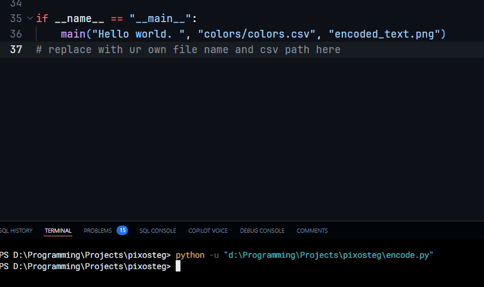
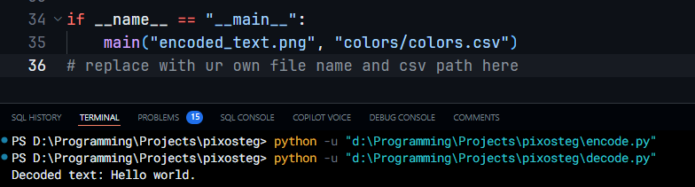

# TO-DO

- take input for files as command line arguments
- merge both encoder and decoder to one file and prompt user for their choice of actions
- using a single color for a character might be easier to decode. so for every sentence try to rotate color of the character to the next column color and try to cycle among them further on

# Pixosteg

Pixosteg is a steganography tool designed to conceal text within images in a way that is not noticeable at a glance. It operates by mapping each character of the input text to a unique color, which is then used to generate a single-row PNG image where each pixel represents a character from the text. This method allows for the encoding of messages in a visual format, effectively hiding the text in plain sight.

### How Pixosteg Works

1. **Encoding Process:**
   - The user provides the text they wish to encode and the path to a CSV file containing color mappings for each character.
   - The tool reads the color mappings from the CSV file, associating each character with a specific color.
   - For each character in the input text, Pixosteg finds the corresponding color in the mappings and creates a pixel of that color.
   - These colored pixels are arranged in a single row to form an image, which is then saved as a PNG file. This file visually represents the encoded text.

2. **Decoding Process:**
   - To decode, the user provides the PNG image created during the encoding process and the same CSV file used for encoding.
   - Pixosteg reads the image, extracting the color of each pixel in the single-row image.
   - It then matches each pixel's color to the character mappings defined in the CSV file, effectively reversing the encoding process.
   - By mapping each color back to its corresponding character, Pixosteg reconstructs the original text from the image.

## Example

### To encode text use `encode.py`

### Here i have provided the text `Hello world.` and the following csv (`colors/colors.csv`) to the encoding script:

### This is the image we obtained

### Now to decode, lets use `decode.py`

### Success! we obtained our original message!